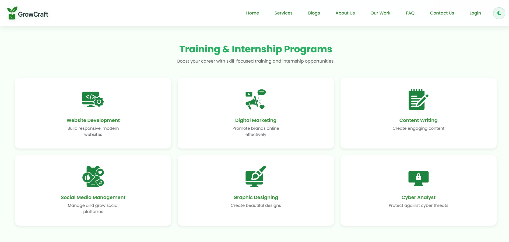
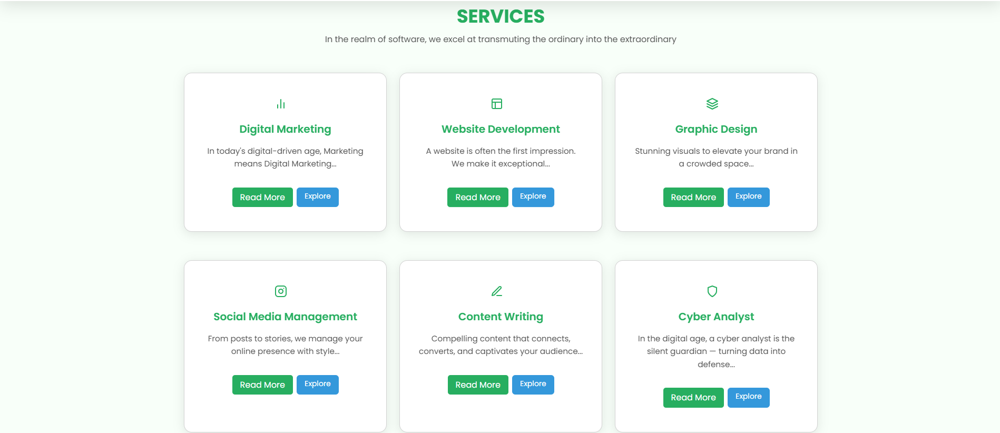

[](https://discord.gg/VDHMkaXCYP)

# 🌱 GrowCraft

GrowCraft is a **service-based platform** designed to help businesses grow online while also providing students with hands-on experience through training and internships.  

> 🏆 **This repository is part of GirlScript Summer of Code 2025 (GSSoC'25) and Hacktoberfest 2025**  


  


> Contributions from the community are welcome!

---
## 📑Table of Contents

- [Features](#features)
- [Folder Structure](#folder-structure)
- [Contributors](#contributors)
- [Tech Stack](#tech-stack)
- [Getting Started](#getting-started)
- [Contributing](#contributing)
- [Screenshots](#screenshots)
- [License](#license)
- [Acknowledgements](#acknowledgements)


---
---

##  Features

- 🌐 **Website Development**
- 🖌️ **Graphic Design**
- ✍️ **Content Writing**
- 📣 **Social Media Management**
- 📊 **Digital Marketing**
- 💻 **Cyber Analyst**
- 🎓 **Training & Internship Programs**

This platform offers services to clients and creates opportunities for students to learn by doing.

---

##  Folder Structure

```
# 🌱 GrowCraft Project Structure

GrowCraft/
├── index.html 🏠
├── about.html 👩‍💻
├── blogListing.html 📰
├── blogView.html 🧾
├── blogWrite.html ✍️
├── contact.html 📞
├── careers.html 💼
├── terms.html / privacy.html 📜
├── service.html ⚡
├── work.html 💡
├── contact-handler.php 🧩
├── database_schema.sql 🧮
│
├── .github/ ⚙️
│   ├── ISSUE_TEMPLATE/
│   │   ├── bug_report.yml 🐞
│   │   ├── feature_request.yml ✨
│   │   ├── documentation.md 📘
│   │   └── performance.md ⚡
│   ├── workflows/
│   │   ├── issue-create-automate-message.yml 🤖
│   │   └── pr-create-automate-message.yml 🤝
│   └── pull_request_template.md 🧾
│
├── components/ 🧱
│   ├── backtotop.{css, js} 🔼
│   ├── chatbot.{css, js} 💬
│   └── footer.{css, html} 🦶
│
├── images/ 🖼️
│   ├── (icons, assets, and illustrations used across the site)
│
├── learn/ 📚
│   ├── contentwriting.html ✏️
│   ├── cyberanalyst.html 🛡️
│   ├── marketing.html 📢
│   ├── graphic.html 🎨
│   ├── socialmedia.html 🌐
│   └── webdev.html 💻
│
├── src/ 🧩
│   ├── contact.html / contact.css / contact.js 📞
│   ├── blogs.css / blogs.js 📰
│   ├── style.css / script.js 🎨
│   ├── utils.js ⚙️
│   ├── web.html 🌍
│   └── css/
│       └── style.css 🎨
│
├── netlify/ ☁️
│   └── functions/
│       └── getContributors.js 👥
│
├── docs/ 📄
│   ├── CODE_OF_CONDUCT.md 📜  
│   ├── CONTRIBUTING.md 🤝  
│   ├── CONTACT_PAGE_DOCS.md 📞  
│   ├── START_PROJECT_GUIDE.md 🚀  
│   └── LICENSE ⚖️  
│
├── _redirects 🧭
├── netlify.toml ⚙️
├── start-growcraft.{bat, ps1} 🚀
└── .gitignore 🙈

```

---
##  Contributors
<a href="https://github.com/gyanshankar1708/GrowCraft/graphs/contributors">

Made with [contrib.rocks](https://contrib.rocks).


---
##  Tech Stack

- **Frontend:** HTML5, CSS3, Bootstrap 5.3  
- **Scripting:** JavaScript (vanilla)  
- **Backend (minimal):** PHP (for contact form handler)  
- **Database:** MySQL (schema included)


---

<div align="center">

  <h1><u>Meet our Project Admin and Mentors</u></h1>

  <table>
    <tr>
      <td>
        <a href="https://github.com/gyanshankar1708">
          <br>
          <sub><b>Gyanshankar Singh</b></sub>
        </a>
      </td>
      <td>
        <a href="https://github.com/Khababakhtar20">
          <br>
          <sub><b>Khabab Akhtar</b></sub>
        </a>
      </td>
      <td>
        <a href="https://github.com/abdullahxyz85">
          <br>
          <sub><b>Abdullah Jameel</b></sub>
        </a>
      </td>
      <td>
        <a href="https://github.com/ayushkashyap402">
          <br>
          <sub><b>Ayush Kashyap</b></sub>
        </a>
      </td>
    </tr>
  </table>

</div>

---

##  Getting Started

### Prerequisites
- A modern browser
- (Optional) XAMPP / WAMP for running PHP contact form locally

### Steps
1. Clone the repository:
   ```
   git clone https://github.com/gyanshankar1708/GrowCraft.git
   ```
2. Open `index.html` in your browser to view the website.
3. (Optional) To enable the contact form:
   - Set up a local server (XAMPP/WAMP)
   - Place the project in the `htdocs` folder
   - Import `database_schema.sql` into MySQL
   - Update the PHP configuration in `contact-handler.php`

---

##  Contributing

We welcome contributions from everyone!  
If you're participating through **GSSoC'25**:

1. Look for issues labeled `GSSoC` or `good first issue`.
2. Comment on the issue you'd like to work on and wait for assignment.
3. Fork the repository, make your changes, and submit a PR.

Please read our [Contributing Guidelines](src/CONTRIBUTING.md) and [Code of Conduct](CODE_OF_CONDUCT.md) before contributing.

---

##  Screenshots

### Landing Page


### Services Section


*(Add more screenshots or a GIF preview here if available)*

---

##  License

This project is licensed under the terms specified in the [LICENSE](LICENSE) file.

---

##  Acknowledgements

- **GirlScript Summer of Code 2025 (GSSoC'25)** for providing an open-source platform
- Project contributors and mentors
- Open-source community for continuous inspiration

- **Hacktoberfest 2025** by DigitalOcean, GitHub, and partners for encouraging global open-source contributions  
- All the amazing **contributors and maintainers** who made this event impactful  
- The vibrant **open-source community** for spreading collaboration, innovation, and learning 🌍  


